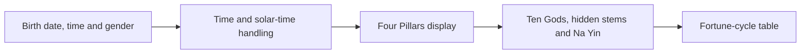

# BaZi Chart Source Code | Four Pillars, Ten Gods and Five Elements

[Main README](README.md) · [简体中文](README.zh-CN.md) · [繁體中文](README.zh-TW.md) · [English product page](https://alibabama401.github.io/I-Ching-BaZi-Complete-Source/en/)

This repository presents a Chinese astrology product and a partial source-code sample. The root `index.html` is a standalone HTML and JavaScript BaZi chart demo. It accepts a name, gender, birth date and time, then displays the Four Pillars, Ten Gods, hidden stems, Na Yin labels, solar-time information and a fortune-cycle table.

The repository also includes Java service interfaces for users, orders, chart records, task results and Five Elements configuration, together with eight real product screenshots.

## Features

| Feature | Verifiable public content |
|---|---|
| BaZi Four Pillars | Year, month, day and hour pillar UI |
| Ten Gods and hidden stems | Mapping logic and branch data in the browser demo |
| Na Yin and Five Elements | Na Yin labels, a configuration interface and screenshots |
| Birth-time input | Date, time zone, coordinates and solar-time indicators |
| Fortune cycles | Example age ranges, stem-branch cycles and year intervals |
| Service boundaries | Java interfaces for users, charts, tasks, orders and settings |
| Localized pages | Simplified Chinese, Traditional Chinese and English pages |

## How the demo works



Open `index.html` in a browser, enter the birth information, select a gender and choose **开始排盘**. The page updates the Four Pillars and related sections without a build step.

## Product screenshots

| BaZi chart | Da Liu Ren |
|---|---|
|  |  |
| **Annual fortune cycles** | **Chart system** |
|  |  |
| **Qi Zheng Si Yu** | **Five Elements analysis** |
|  |  |

## Technology and repository map

| File or area | Purpose |
|---|---|
| `index.html` | HTML, CSS and vanilla JavaScript chart demo |
| `PanRecordService.java` | Chart-record service interface |
| `MoiraRecordService.java` | Multi-system data and export method signatures |
| `MoiraTaskService.java` | Task execution, status and ordering interface |
| `UserService.java` | Registration, login, profile and coordinate methods |
| `WuXingConfigService.java` | Five Elements configuration interface |
| `docs/` | Localized GitHub Pages site, screenshots and search files |

## Run the public demo

```bash
git clone https://github.com/alibabama401/I-Ching-BaZi-Complete-Source.git
cd I-Ching-BaZi-Complete-Source
```

Open `index.html` in a browser. No package installation is required for the static demo.

## Public scope and limitations

The Java files are interface fragments rather than a complete buildable backend. The root demo contains simplified or placeholder logic for some calendar, Na Yin and fortune-cycle calculations. Product screenshots demonstrate interfaces and use cases; they do not prove that every pictured algorithm is included in the public repository. Production use requires implementations, dependencies, documented calendar rules and tests.

## Search terms

I Ching source code, BaZi source code, BaZi calculator, BaZi chart, Four Pillars of Destiny, Chinese astrology software, Ten Gods, hidden stems, Five Elements, fortune cycles, Zi Wei Dou Shu, Qi Men Dun Jia, Da Liu Ren, Qi Zheng Si Yu.

## License and contact

Read [LICENSE](LICENSE) and [License.md](License.md) before reuse.

- Email: [ttpoker40@gmail.com](mailto:ttpoker40@gmail.com)
- Telegram: [@alibabama401](https://t.me/alibabama401)

This repository is for traditional-culture software presentation, technical research and product evaluation. It does not provide medical, legal, financial or other professional advice.
