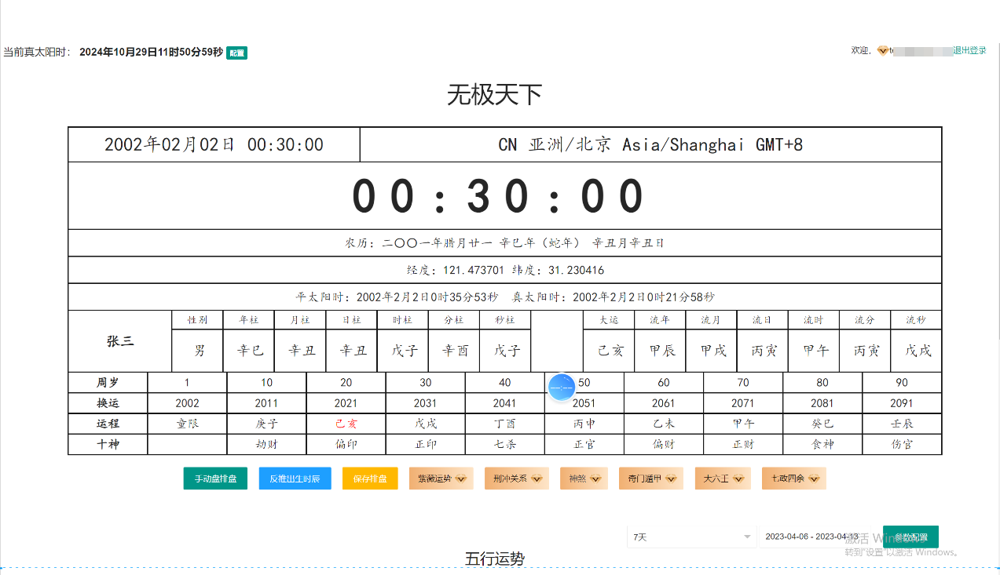

# 周易八字排盤完整原始碼｜I Ching BaZi Complete Source

[简体中文](README.md) | [繁體中文](README.zh-TW.md) | [English](README.en.md)

本專案是面向周易八卦、四柱八字、奇門遁甲、紫微斗數、大六壬、七政四餘、五行分析和傳統文化應用的完整原始碼專案，適合用於產品展示、技術評估、二次開發、私有化部署和 GitHub Pages 搜尋優化。

## 閱讀與下載

- 線上首頁：https://alibabama401.github.io/I-Ching-BaZi-Complete-Source/
- GitHub 倉庫：https://github.com/alibabama401/I-Ching-BaZi-Complete-Source
- 建議先閱讀本 README，再查看 `docs/index.html` 發布後的產品首頁。
- 如果需要下載原始碼，請在倉庫右上角點擊 `Code`，再選擇 `Download ZIP`。

## 專案定位

本倉庫聚焦 **I Ching BaZi Complete Source**，可用於建構線上八字排盤、周易八卦、五行分析、流年分析、七政四餘、大六壬和傳統文化 AI 決策輔助系統。

## 產品截圖

## 📁 联系 | 📞 Contact

📧 Email: ttpoker40@gmail.com

💬 Telegram: @alibabama401

## 核心功能

- 八字排盤、五行分析、流年分析和傳統文化內容展示
- 大六壬、七政四餘、周易八卦等術數應用場景
- 適合產品介紹頁、技術文件和多語言 README 優化
- 支援二次開發、介面優化、功能擴展和私有化部署

## 適用場景

- 周易八字系統原始碼展示
- 傳統文化 AI 工具與命理軟體專案
- 線上排盤、測算、諮詢和內容平台

## 關鍵詞

周易原始碼、八字原始碼、八字排盤系統、周易占卜原始碼、五行分析、七政四餘、大六壬、I Ching source code、Bazi complete source、Chinese metaphysics software。

## 免責聲明

本專案用於傳統文化軟體展示、技術研究、產品評估和合規應用開發。內容僅供參考，不構成確定性預測，也不構成醫療、法律、金融或人生決策建議。
