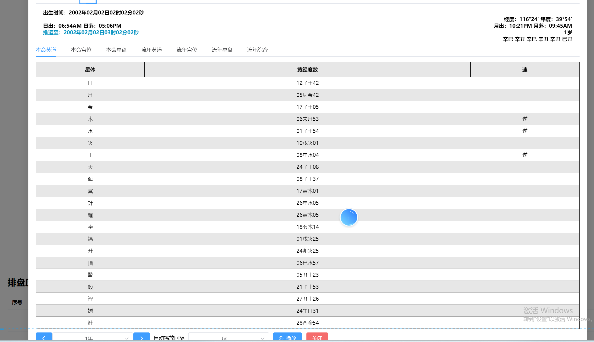
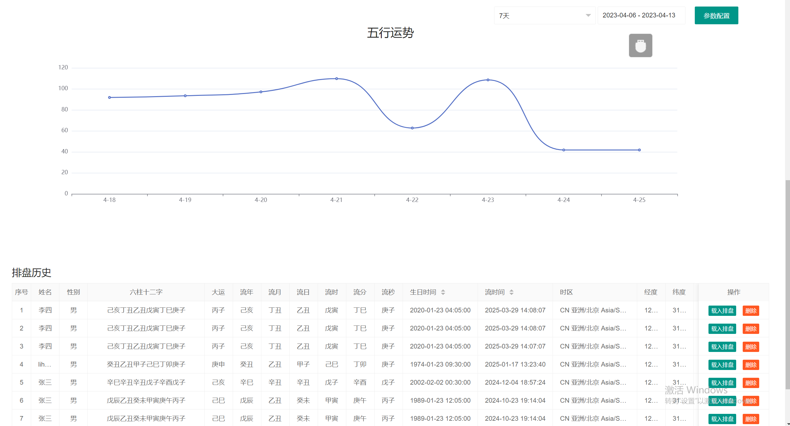

# 八字排盤原始碼｜四柱、十神、藏干、五行與大運流年

[主 README](README.md) · [简体中文](README.zh-CN.md) · [English](README.en.md) · [繁體中文產品頁](https://alibabama401.github.io/I-Ching-BaZi-Complete-Source/zh-tw/)

本倉庫展示周易八字排盤產品與部分原始碼。根目錄 `index.html` 是可直接開啟的 HTML/JavaScript 示範，包含姓名、性別、出生日期時間輸入，以及四柱干支、十神、藏干、納音、太陽時提示和大運表格。Java 檔案展示使用者、訂單、排盤記錄、任務結果及五行設定的服務介面。

## 功能範圍

| 功能 | 可核驗內容 |
|---|---|
| 四柱八字 | 年柱、月柱、日柱、時柱頁面展示 |
| 十神藏干 | 十神映射與地支藏干資料 |
| 納音五行 | 納音展示、五行設定介面和產品截圖 |
| 時間處理 | 出生時間、時區、經緯度和太陽時提示 |
| 大運流年 | 大運年齡、干支和年份表格示例 |
| 資料服務 | 使用者、排盤記錄、任務、訂單及五行設定介面 |

## 操作流程

開啟 `index.html`，選擇出生日期時間與性別，點擊「開始排盤」，然後查看四柱、十神、藏干、納音和大運表格。該頁面適合產品原型和程式碼閱讀；其中部分曆法邏輯為簡化或佔位實作。

## 產品截圖

| 八字排盤 | 流年分析 |
|---|---|
|  |  |
| **七政四餘** | **五行分析** |
|  |  |

## 技術與原始碼

- `index.html`：HTML、CSS、原生 JavaScript 互動示範。
- `PanRecordService.java`：排盤記錄服務介面。
- `MoiraRecordService.java`：多術數資料與匯出方法簽名。
- `MoiraTaskService.java`：任務執行、狀態和排序介面。
- `UserService.java` / `UserOrderService.java`：使用者及訂單服務介面。
- `docs/`：簡體、繁體、英文 GitHub Pages 頁面與搜尋引擎檔案。

## 公開範圍

目前 Java 檔案並非完整工程，缺少實作類別、領域模型、依賴和建置設定。截圖展示產品功能場景，不等同於對應演算法全部開源。評估與二次開發時請以實際檔案和授權範圍為準。

## 聯絡

[Email](mailto:ttpoker40@gmail.com) · [Telegram @alibabama401](https://t.me/alibabama401) · [GitHub 倉庫](https://github.com/alibabama401/I-Ching-BaZi-Complete-Source)
